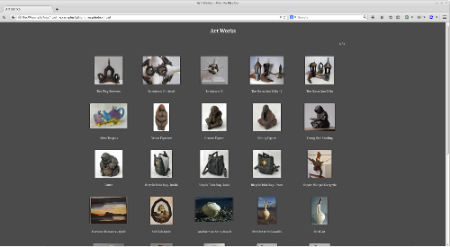
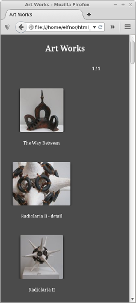
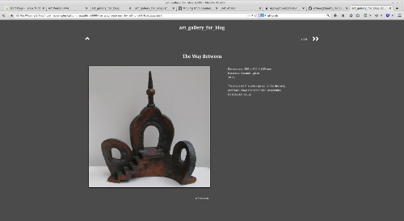
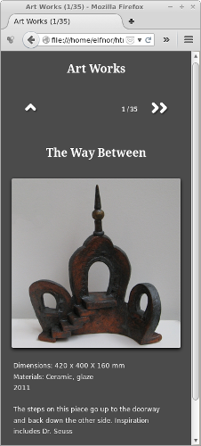

Responsive Dark
=======================

This is a simple web album theme for [gthumb](https://wiki.gnome.org/Apps/gthumb), where the layout changes depending on browser width. It is primarily design for albums which have Titles and Descriptions entered into the respective exif tags of each image.

To install, download this repository (see download zip button to the right). Unzip and copy the `Responsive_Dark` folder to the theme location. On my Linux Mint installation this is `/usr/share/gthumb/albumthemes/`

Start gthumb, choose the files for the web album, select `File>Export To>Web Album`. Select the `Responsive Dark` theme from the Theme box. Make sure `Adapt to the window width` is set on the `Index Page` tab.

Other settings I also used:

`Index Page` tab:

*  `Thumbnail Caption`  set to `Title`
*  `All images on a single page` set

`Image Page` tab:

*  `Show the description, if available` set
*  `Show the following attributes:` set to `Title`

Screenshots
---------

###Index Page###

&nbsp; 
&nbsp; 
&nbsp; 
&nbsp; 
&nbsp; 
&nbsp; 

###Image Page###

&nbsp; 
&nbsp; 
&nbsp; 
&nbsp; 
&nbsp; 
&nbsp; 

Demo Album
---------

Coming to github soon...

